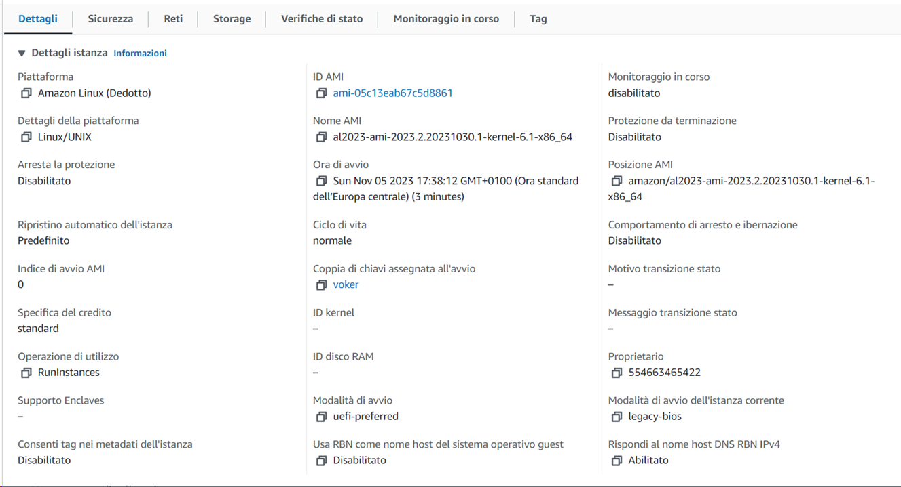

# ADM-HW2
- Folder **AWSQ**(related to AWSQ question) contains script **start.py**
- Folder **CLQ**(related to CLQ question) contains scripts: **commanline_LLM.sh** and **commandline_original.sh**
- File **main.ipynb** contains all other exercises besides two above
### CLQ(command line question)
#### Below you can see execution of commandline_original.sh and commandline_LLM.sh
- The file which had been used in script is called **series.json**
- Below you can see result of **commanline_LLM.sh** and **commandline_original.sh**


### AWSQ
- Below u can see all information about configuration of EC2 instance



- command which had been used for connection
```
ssh -i C:\Users\150224\voker.pem ec2-user@54.80.12.38
```
- command for upload
```
scp -i C:\Users\150224\voker.pem -r start.py ec2-user@54.80.12.38:/home/ec2-user
scp -i C:\Users\150224\voker.pem -r list.json ec2-user@54.80.12.38:/home/ec2-user
```
- output of scripts and their results
<br />Local machine<br />

<br />EC2 instance<br />
